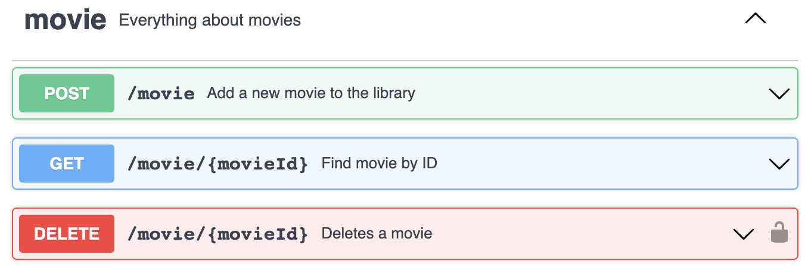
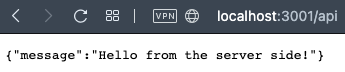
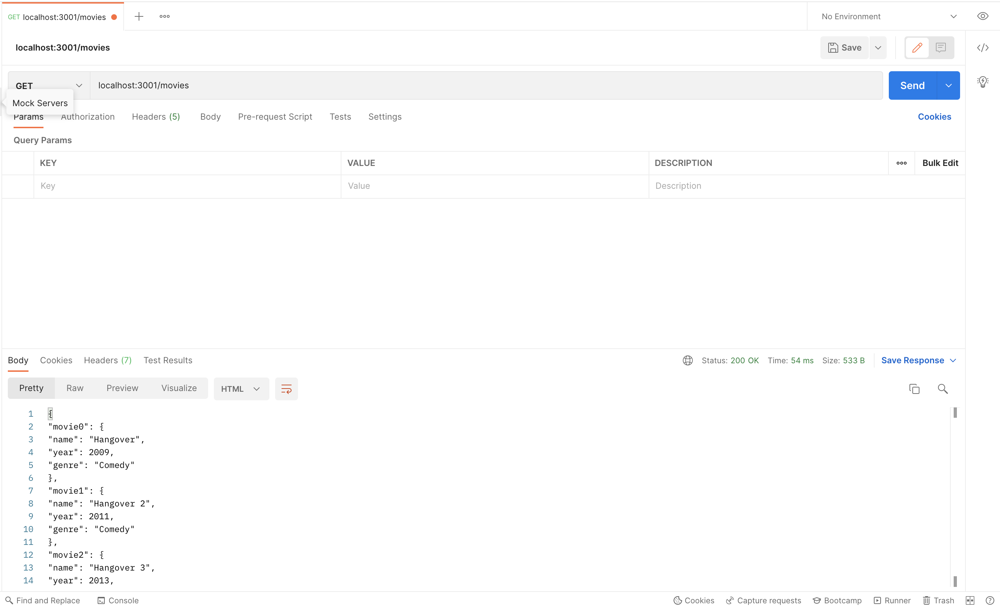
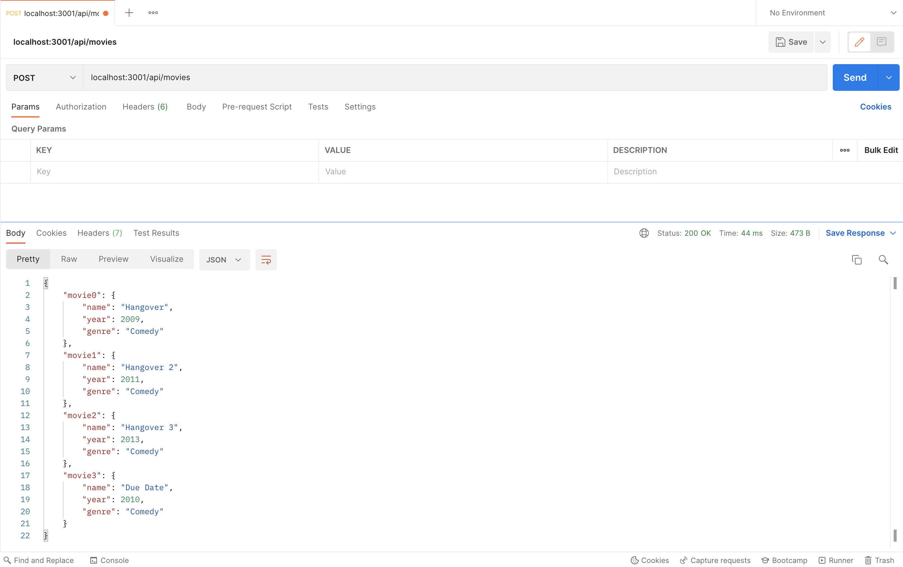
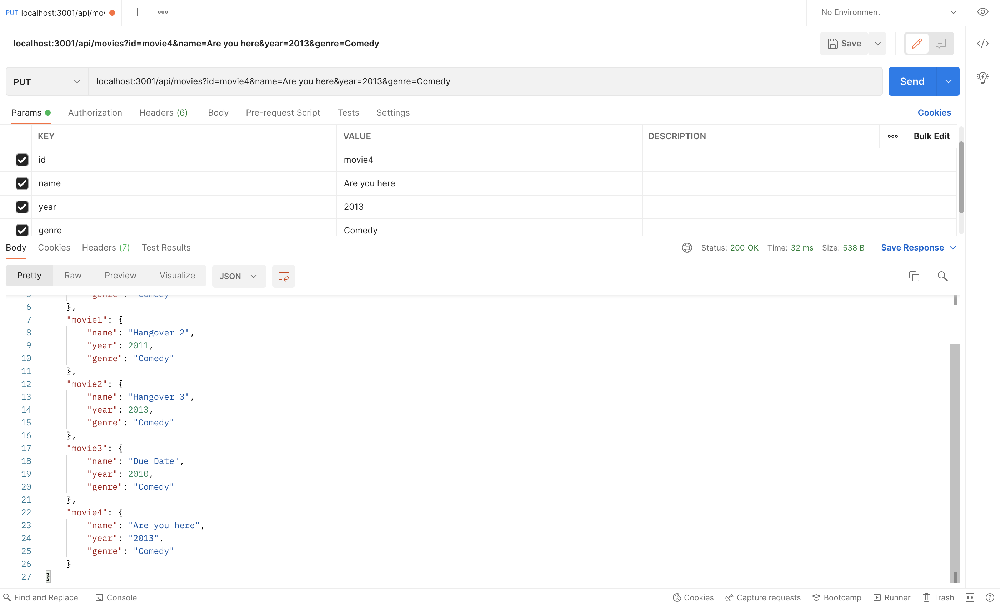
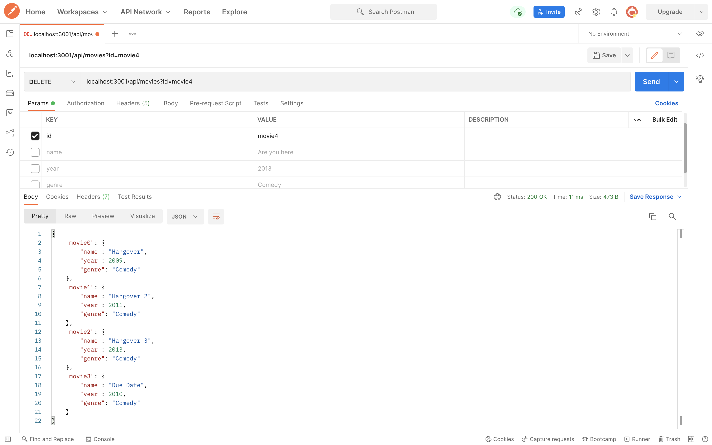

# Semana tec (Conectando el mundo web)

## Table of Contents
1. [Día 1](#día-1)
2. [Día 2](#example2)
3. [Día 3](#third-example)
4. [Fourth Example](#fourth-examplehttpwwwfourthexamplecom)

## Día 1

## Act 1.1

### Responde las siguientes preguntas:

- ¿Cuales son los servidores más comunes?
    - Apache HTTP Server
    - Nging
    - Litespeed
    - Microsoft IIS
    - OpenResty
- ¿Cuales son los browsers más usados?
    - Chrome
    - Safari
    - Edge
    - Firefox
    - Samsung Internet
    - Android
- ¿Cómo se comunican los browsers y los servidores web?
    - Using the HyperText Transfer Protocol (HTTP).

### Entra al modo desarrollador e inspecciona

- ¿Qué elementos obserbas?¿Para qué crees que sirvan?
    - Elements (Elementos HTML de la pagina)
    - Console (Consola para ejecutar JS)
    - Sources (Todos los elementos de HTML incluidos con la tag script)
    - Network (Grabar actividad de la red)

## Act 1.2

### Preguntas

- ¿Qué es un web framework?
    - Un conjunto de herramientas y recursos disponibles para los desarrolladores web.
- ¿Cuales son los frameworks de back-end más usados?
    - Laravel
    - Django
    - Express
    - Flask
    - Ruby on rails
- ¿Cuales son los frameworks de front-end más usados?
    - React
    - JQuery
    - Angular
    - Vue
    - Angular
    - Svelte

### Explora el sitio [State of JS](https://2020.stateofjs.com/en-US/technologies/) ¿Qué te llama la atención?

- Que solo hay un framework de front y uno de backend en el cuadrante de have used y possitive opinions en la gráfica(React y express)

## Act 1.3 Creando nuestro servidor web

## Act 1.4

- ¿Qué es una API(Aplication programming iinterface)?
    - Sirve para communicar varias aplicaciones para que puedan compartir datos.
- ¿Qué es una web API?
    - API que puede ser accedida mediante el protocolo http
- ¿A qué se refieren los endpoints?
    - Donde el API se comunica con otro sistema.

---

## Día 2

### Act 2.1

- Cómo le explicarías a tu abuelita/o SOAP y REST?
    - Son formas en las que los sistemas se comunican los sistemas, REST es solo una serie de reglas para guiarte que es muy libre y se puede memorizar cierta parte de los datos (cache). Mientras que SOAP es un protocolo que es más restrictivo y caro de implementar, pero es más seguro.
- ¿Dónde crees que se utiliza SOAP? ¿Dónde REST?
    - REST se utiliza en el mundo web en general y SOAP se utiliza para más para empresas grandes, bancos, hospitales, etc.

### Act 2.2

Entra a Swagger y modifica el ejemplo de la tienda de mascotas

### Act 2.3 - 2.6

- **Creando el primer endpoint**

- **GET**

- **POST**

- **PUT**

- **DELETE**

## Día 3