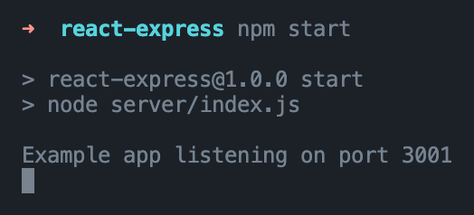
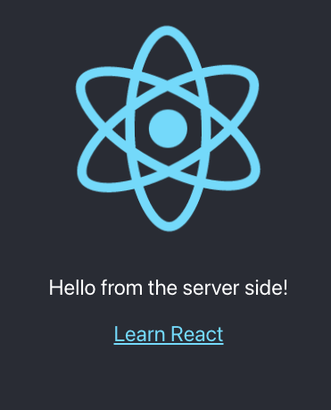
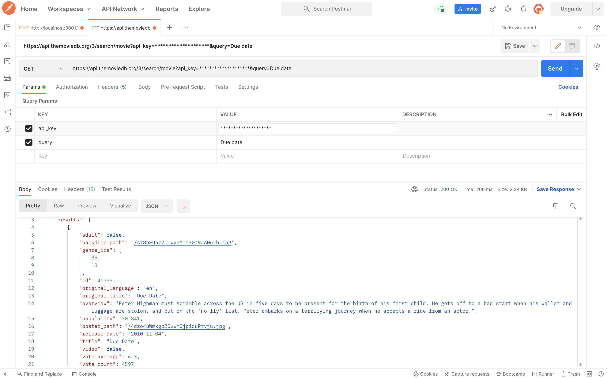
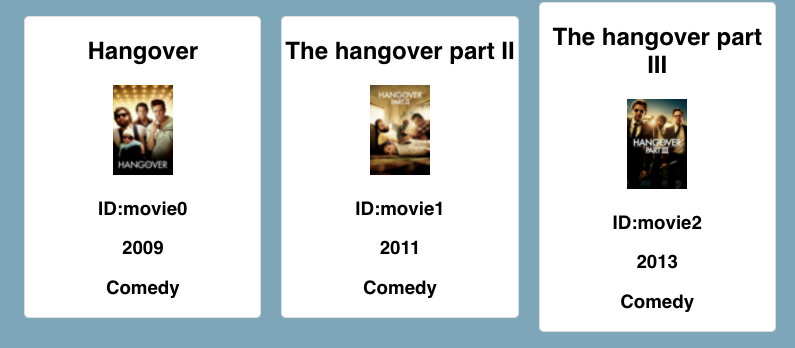
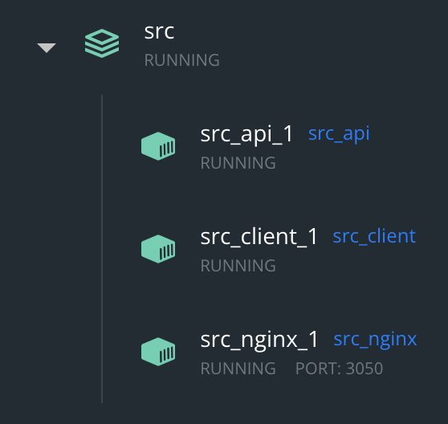
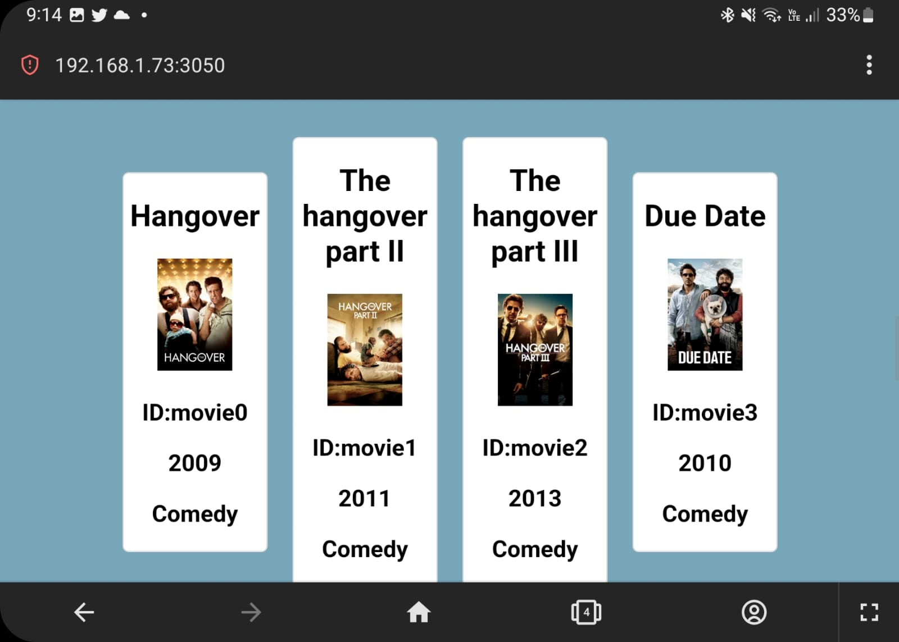

# Semana tec (Conectando el mundo web)

### [Repositorio de GitHub](https://github.com/DanielCordovaV/conectando-el-mundo-web)

## Tabla de contenidos
- [Día 1](#día-1)
- [Día 2](#día-2)
- [Día 3](#día-3)
- [Día 4](#día-4)

## Día 1

## Act 1.1

### Responde las siguientes preguntas:

- ¿Cuales son los servidores más comunes?
    - Apache HTTP Server
    - Nging
    - Litespeed
    - Microsoft IIS
    - OpenResty
- ¿Cuales son los browsers más usados?
    - Chrome
    - Safari
    - Edge
    - Firefox
    - Samsung Internet
    - Android
- ¿Cómo se comunican los browsers y los servidores web?
    - Using the HyperText Transfer Protocol (HTTP).

### Entra al modo desarrollador e inspecciona

- ¿Qué elementos obserbas?¿Para qué crees que sirvan?
    - Elements (Elementos HTML de la pagina)
    - Console (Consola para ejecutar JS)
    - Sources (Todos los elementos de HTML incluidos con la tag script)
    - Network (Grabar actividad de la red)

## Act 1.2

### Preguntas

- ¿Qué es un web framework?
    - Un conjunto de herramientas y recursos disponibles para los desarrolladores web.
- ¿Cuales son los frameworks de back-end más usados?
    - Laravel
    - Django
    - Express
    - Flask
    - Ruby on rails
- ¿Cuales son los frameworks de front-end más usados?
    - React
    - JQuery
    - Angular
    - Vue
    - Angular
    - Svelte

### Explora el sitio [State of JS](https://2020.stateofjs.com/en-US/technologies/) ¿Qué te llama la atención?

- Que solo hay un framework de front y uno de backend en el cuadrante de have used y possitive opinions en la gráfica(React y express)

### Act 1.3 Creando nuestro servidor web

Inicia tu servidor web en el puerto 3001

### Act 1.4

- ¿Qué es una API(Aplication programming iinterface)?
    - Sirve para communicar varias aplicaciones para que puedan compartir datos.
- ¿Qué es una web API?
    - API que puede ser accedida mediante el protocolo http
- ¿A qué se refieren los endpoints?
    - Donde el API se comunica con otro sistema.

---

## Día 2

### Act 2.1

- Cómo le explicarías a tu abuelita/o SOAP y REST?
    - Son formas en las que los sistemas se comunican los sistemas, REST es solo una serie de reglas para guiarte que es muy libre y se puede memorizar cierta parte de los datos (cache). Mientras que SOAP es un protocolo que es más restrictivo y caro de implementar, pero es más seguro.
- ¿Dónde crees que se utiliza SOAP? ¿Dónde REST?
    - REST se utiliza en el mundo web en general y SOAP se utiliza para más para empresas grandes, bancos, hospitales, etc.

### Act 2.2

Entra a Swagger y modifica el ejemplo de la tienda de mascotas

### Act 2.3 - 2.6

- **Creando el primer endpoint**

- **GET**

- **POST**

- **PUT**

- **DELETE**

---
## Día 3

### Act 3.1

- Vuelve a entrar a State of JS y elige algún framework de front-end. Describe por qué sería útil o 
en qué caso debería usarse basado en la información presentada.

    - Elegí Svelte porque según los gráficos tiene muchas opiniones buenas aunque tiene pocos usuarios, cae en las tecnologías que vale la pena evaluar.

- ¿Qué es un proxy? ¿Para qué lo utilizamos para conectar nuestros servicios?

    - Un servidor proxy es básicamente una maquina en Internet con su propia dirección IP que tu ordenador conoce. Cuando envías un request, esta va primero al servidor proxy. Después el servidor proxy realiza el request en tu nombre, toma la respuesta del servidor y te reenvía los datos de la página web para que puedas verla en tu navegador.

### Act 3.2-3.3

**Crea un cliente de react con "create-react-app" y conéctalo con tu back-end.**

### Act 3.4

- Explora más sobre ReactJS en su documentación (Enlaces a un sitio externo.) y responde lo siguiente:
    - ¿Qué es JSX?
        - Es una extención de sintaxis de JavaScript para describir como se tiene que ver el UI.
    - ¿Qué son los componentes y los props?
        - Los componentes son los bloques que conforman una aplicación de react y los props son los valores de entrada para modificar estos bloques.
    - ¿Qué es el estado y el ciclo de vida?
        - El estado es un atributo local de un componente y el ciclo de vida es el proceso que sigue un componente de react desde durante su creación, actualización o destrucción.
    - ¿Cómo manejamos eventos?
        - Usando la propiedad de html on* y agregándole una función.
- Ahora investiga más a fondo la función “fetch” que utilizamos
    - ¿Para qué sirve fetch?
        Para hacer http requests.

### Act 3.5

Revisa la documentación de algunas API de terceros
- ¿Cuáles te llaman la atención? ¿Por qué?
    - Me llamó la atención el api de the movie database porque funciona con el proyecto que armé en la semana.
- ¿Qué información podrías obtener de estas APIs?
    - Las plataformas en las que existen las peliculas en la lista de peliculas.
- ¿Cómo podrías conectar tu front-end con ellas?
    - Con http requests enviando un API key que ellos proporcionan cómo un header

### Act 3.6

1. Realiza algún request al API del tercero y obtén información, utilicé The movie database

2. Crea 1 componente de React que despliegue información obtenida de la API externa.

---

## Día 4

**Laboratorio ligero**

Mi teclado USB tuvo una falla, por lo que no pude montar el servidor en la raspberry pi, lo que hice fue correrlo con docker compose en mi máquina, por lo que debería de funcionar en cualquier máquina que corra Docker.

Para el compose utilicé dos contenedores de node alpine para el front y el back end y uno nginx para el servidor

Anexo la arquitectura del compose:

Para comprobar que funcionara lo abrí en mi celular:

